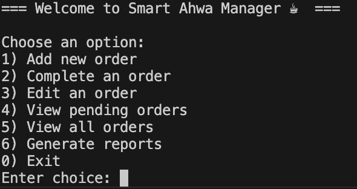
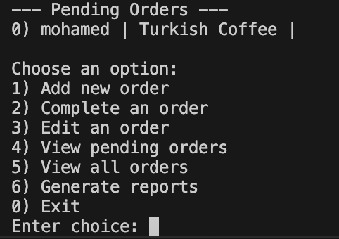
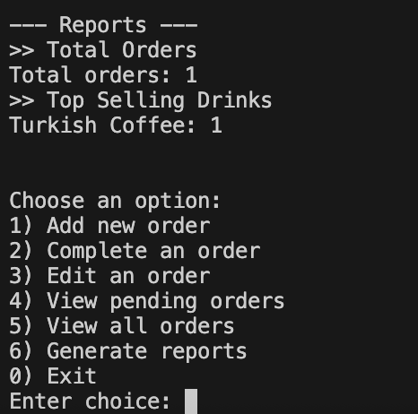

# Smart Ahwa Manager App ☕

A simple **console-based Dart app** to help a coffee shop (*ahwa*) owner in Cairo manage daily operations.  
The app demonstrates **core OOP concepts** and applies **SOLID principles** to keep the code modular, extendable, and easy to maintain.  

---

## 📌 Features
- Add new orders with:
  - Customer name  
  - Drink type (Shai, Turkish Coffee, Hibiscus Tea)  
  - Special instructions (e.g., “extra mint, ya rais”)  
- Edit existing orders (change name, drink, or notes).  
- Mark orders as completed ✅.  
- View pending orders.  
- View all orders (completed + pending).  
- Generate reports:  
  - Total number of orders  
  - Top-selling drinks  

---

## 🏛 OOP Concepts in Action
- **Encapsulation:**  
  Order fields are private with getters/setters and update methods, so the state is always controlled.  

- **Inheritance & Polymorphism:**  
  Drinks (`Shai`, `TurkishCoffee`, `HibiscusTea`) inherit from an abstract `Drink` class.  

- **Abstraction:**  
  `Report` and `OrderRepository` are abstract classes/interfaces. Different implementations can extend or implement them.  

---

## 🧩 SOLID Principles Applied
- **SRP (Single Responsibility Principle):**  
  - `Order` only stores order data.  
  - `OrderManager` handles order operations.  
  - `Report` classes handle reporting logic.  

- **OCP (Open-Closed Principle):**  
  - Add new drinks by creating a new subclass of `Drink`.  
  - Add new reports (e.g., daily revenue) by creating a new `Report` class without touching old code.  

- **DIP (Dependency Inversion Principle):**  
  - `OrderManager` depends on the abstraction `OrderRepository`.  
  - Current implementation uses `InMemoryOrderRepository`, but can be swapped with a database or Firestore later.  

---

## 📂 Project Structure
```
lib/
 ├─ main.dart                   # Entry point with interactive console menu
 ├─ models/
 │   ├─ order.dart               # Order entity with encapsulation + update method
 │   ├─ drink.dart               # Abstract Drink + concrete subclasses
 │   └─ drinks/
 │       ├─ shai.dart
 │       ├─ turkish_coffee.dart
 │       └─ hibiscus_tea.dart
 ├─ services/
 │   ├─ order_manager.dart       # Handles order logic
 │   ├─ order_repo.dart          # Repository abstraction + in-memory implementation
 │   └─ reports/
 │       ├─ report.dart          # Report abstraction
 │       ├─ total_orders_report.dart
 │       └─ top_selling_report.dart
 └─ screenshots/                 # Screenshots for documentation
```

---

## 🚀 How to Run
Clone the repo:
```bash
git clone https://github.com/your-username/smart_ahwa_manager.git
cd smart_ahwa_manager
```

Run the project:
```bash
dart run lib/main.dart
```

---

## 🖼 Screenshots
- Dashboard (Menu)  
  

- Pending Orders  
  
- Reports  
  

---

## 📝 Notes
This project was built as part of the **Week 1 OOP & SOLID Assignment**.  
It shows how applying OOP and SOLID principles makes software **scalable, testable, and easy to maintain**.  
